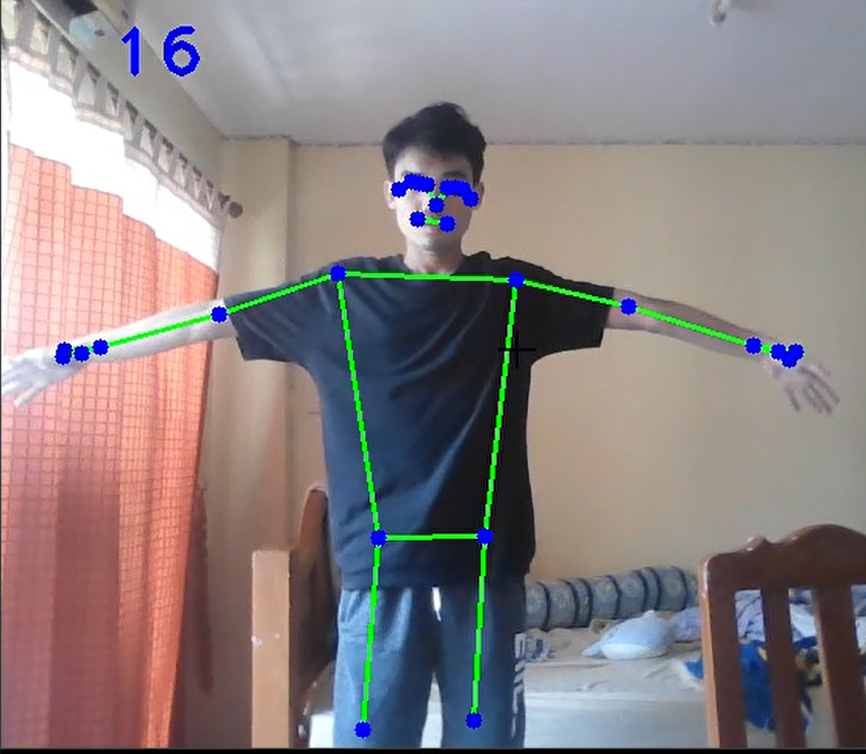
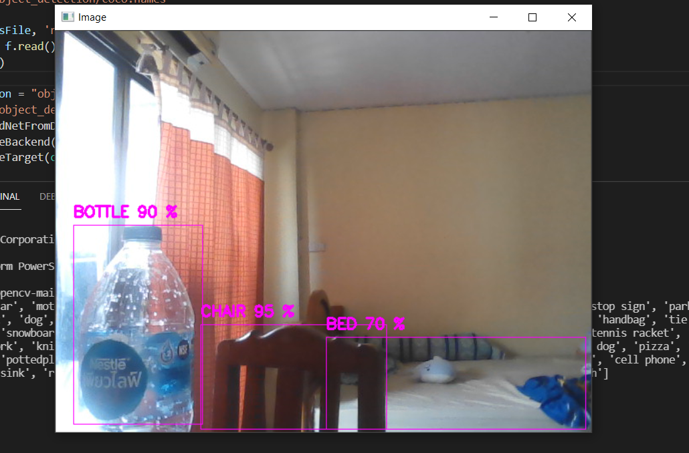
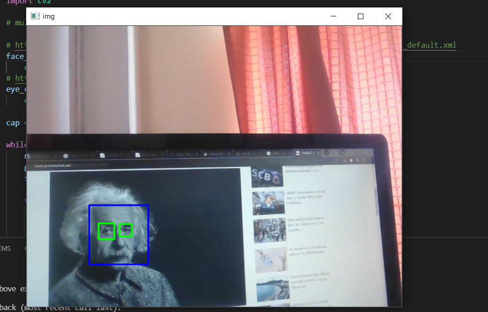

# opencv
##### credit : https://www.youtube.com/c/MurtazasWorkshopRoboticsandAI
###### In folder object_detection want file `yolov3.weight` download from https://pjreddie.com/darknet/yolo/
#### FaceMesh

POSE

object_detection

openTracking

###### controlVoice

-----------------------------------------------------------Other-----------------------------------------------------------------

### ME
#### face_eye (for opencv 4 +)
###### want download : https://github.com/opencv/opencv/blob/master/data/haarcascades/haarcascade_frontalface_default.xml
######       and     : https://github.com/opencv/opencv/blob/master/data/haarcascades/haarcascade_eye.xml

## C++ Coming Soon
